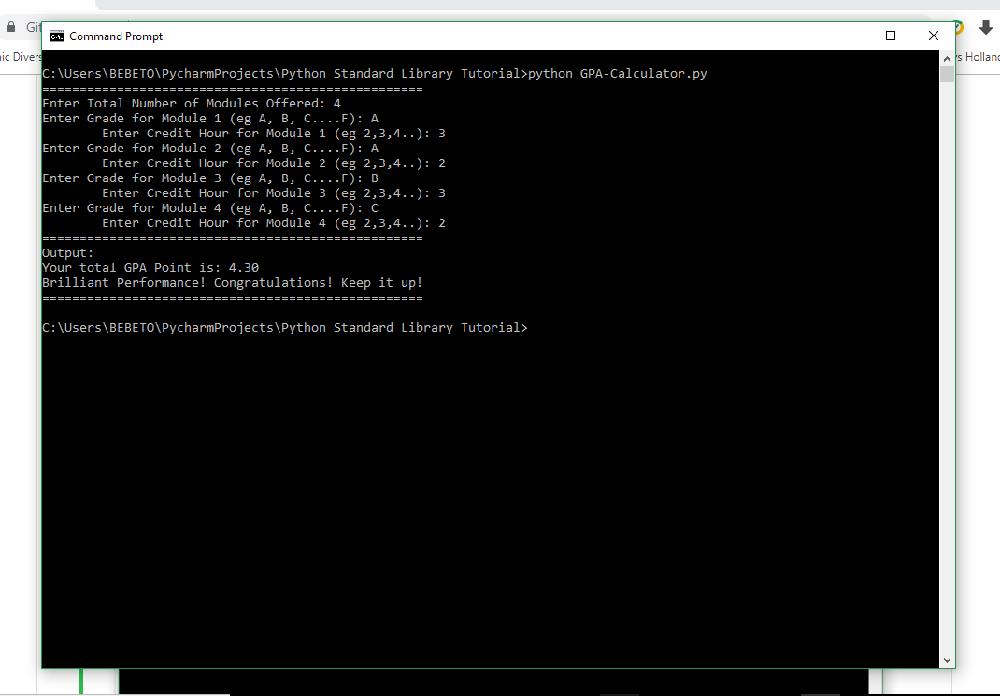

# GPA-Calculator
University Student Cumulative Grade Point calculator

This is a python program that calculates the Semester Grade Point Average(GPA) of a student performance and gives you an ouput of
whether you passed or failed. This program uses **Njala University's GPA calculation basis** and I created it because there was a problem in the aforesaid university with regards to the release of GPA to students. Lecturers made sure the students know their grades but the students didn't know how to calculate their GPA point. So I decided to create this program for my colleagues to be able to calculate their Seasonal or Semester Grade Point Average.

**Output**

The program runs on the python console or even your Command Prompt/terminal and ask students the following questions with ouputs:

As you can see from the photo, the student first enter the "Total no. of modules offered" and based on that the program runs exactly that 
total for inputing of Grades in letters(like getting an A or B or C to F) and also credit hours(like 2 or 3 or 4) for each module. It also
counts based on the no. of modules entered like Module 1, Module 2, Module 3 etc whiles looping. Finally, it prints your **Total GPA point** and a neat message **congratulating you** or prints **sorry** if failed unfortunately.

**Thank You**
